<!-- # [Website](https://kwanwaipang.github.io/DEIO) -->
[comment]: <> (# DEIO)

<!-- PROJECT LOGO -->

<p align="center">

  <h1 align="center"> DEIO: Deep Event Inertial Odometry
  </h1>

[comment]: <> (  <h2 align="center">PAPER</h2>)
  <h3 align="center">
  <a href="">Paper</a> 
  | <a href="https://kwanwaipang.github.io/DEIO">Website</a> 
  | <a href="">Youtube</a> 
  | <a href="">Bilibili</a> 
  </h3>
  
  <!-- <div align="center"></div> -->

<div align="center">
  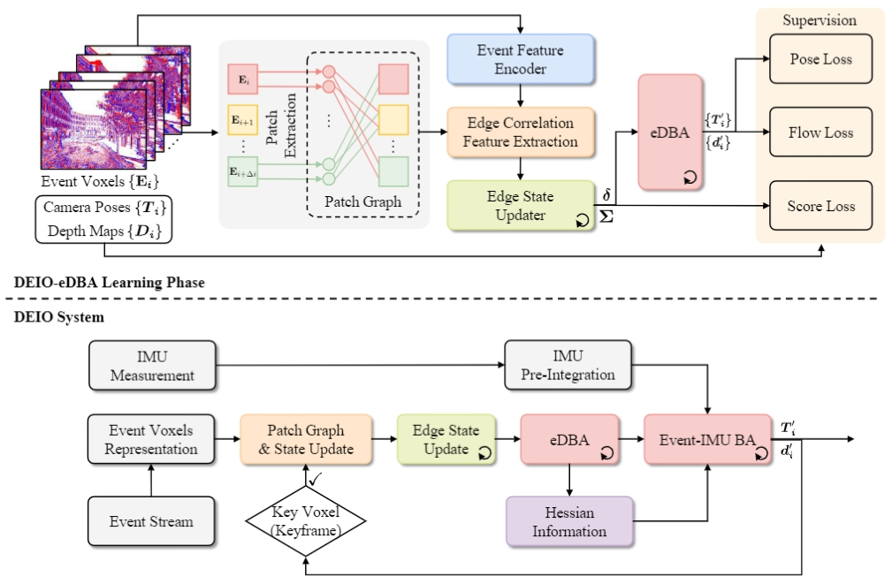
</div>

  <!-- <br> -->

## Abstract
<!-- <p style="text-align: justify;">  -->
<div align="justify">
Event cameras are bio-inspired, motion-activated sensors that demonstrate impressive potential in handling challenging situations, such as motion blur and high-dynamic range.
Despite their promise, existing event-based simultaneous localization and mapping (SLAM) approaches exhibit limited performance in real-world applications.
On the other hand, state-of-the-art SLAM approaches that incorporate deep neural networks for better robustness and applicability.
However, these is a lack of research in fusing learning-based event SLAM methods with IMU, which could be indispensable to push the event-based SLAM to large-scale, low-texture or complex scenarios. 
In this paper, we propose DEIO, the first monocular deep event-inertial odometry framework that combines learning-based method with traditional nonlinear graph-based optimization. 
Specifically, we tightly integrate a trainable event-based differentiable bundle adjustment (e-DBA) with the IMU pre-integration in a factor graph which employs keyframe-based sliding window optimization.
Numerical Experiments in nine public challenge datasets show that our method can achieve superior performance compared with the image-based and event-based benchmarks. 
<!-- </p> -->
</div>

## Update log
- [x] README Upload (2024/10/28)
- [x] Estimated Trajectories Upload (2024/11/07)
- [ ] Paper Upload
- [ ] Evaluated Data Upload
- [ ] Training Data Upload
- [ ] Code Upload (will be released once the paper is accepted)
- [ ] Trainable Event Representation

## Setup and Installation


## Training and Supervision

* The synthetic event-based TartanAir data is generated using the [ESIM](https://github.com/KwanWaiPang/ESIM_comment) simulator. Following [Note1](https://github.com/KwanWaiPang/ESIM_comment/blob/main/rosbag_reading/generate_sim_event.ipynb) and [Note2](https://github.com/KwanWaiPang/ESIM_comment/blob/main/rosbag_reading/upsampled_generate_sim_event.ipynb) for quickly use.

## Evaluating DEIO

### 1. DAVIS240C <sup>[1](https://rpg.ifi.uzh.ch/davis_data.html)</sup>
Download sample sequence from [boxes_6dof, poster_translation]() (ASL format)

Run the DEIO as the following steps:
~~~
conda activate deio

CUDA_VISIBLE_DEVICES=0 PYTHONPATH=${YOUR_WORKSPACE} python script/eval_eio/deio_davis240c.py \
--datapath=${YOUR_DATAFOLDER}  \
--weights=eDBA.pth \
--visual_only=0 \
--evaluate_flag \
--enable_event \
--SCORER_EVAL_USE_GRID
~~~

<br>
<div align="center">
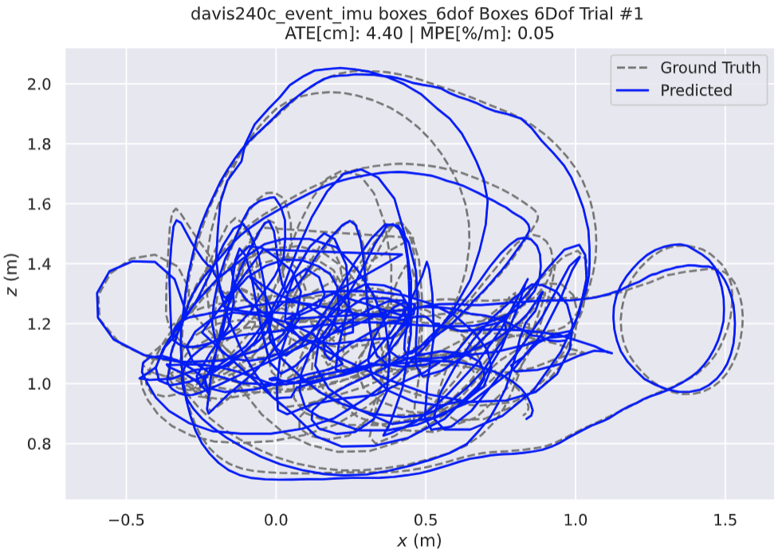
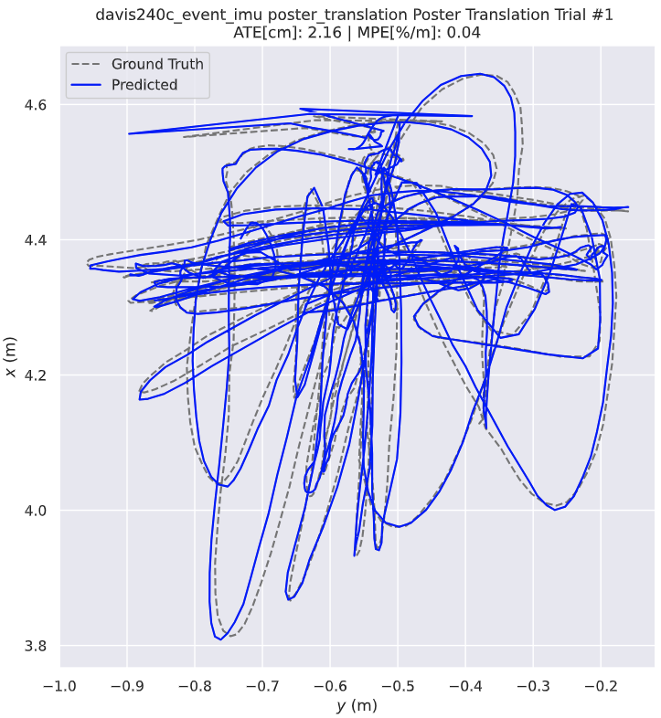
<p>Estimated trajectories against the GT in DAVIS240C</p>
</div>

### 2. Mono-HKU Dataset <sup>[2](https://github.com/arclab-hku/Event_based_VO-VIO-SLAM?tab=readme-ov-file#Dataset-for-monocular-evio)</sup>

Download sample sequence from [vicon_dark1, vicon_hdr4]() (ASL format)

Run the DEIO as the following steps:
~~~
conda activate deio

CUDA_VISIBLE_DEVICES=0 PYTHONPATH=${YOUR_WORKSPACE} python script/eval_eio/deio_mono_hku.py \
--datapath=${YOUR_DATAFOLDER} \
--weights=eDBA.pth \
--visual_only=0 \
--evaluate_flag \
--enable_event \
--SCORER_EVAL_USE_GRID \
--side=davis346
~~~

<br>
<div align="center">
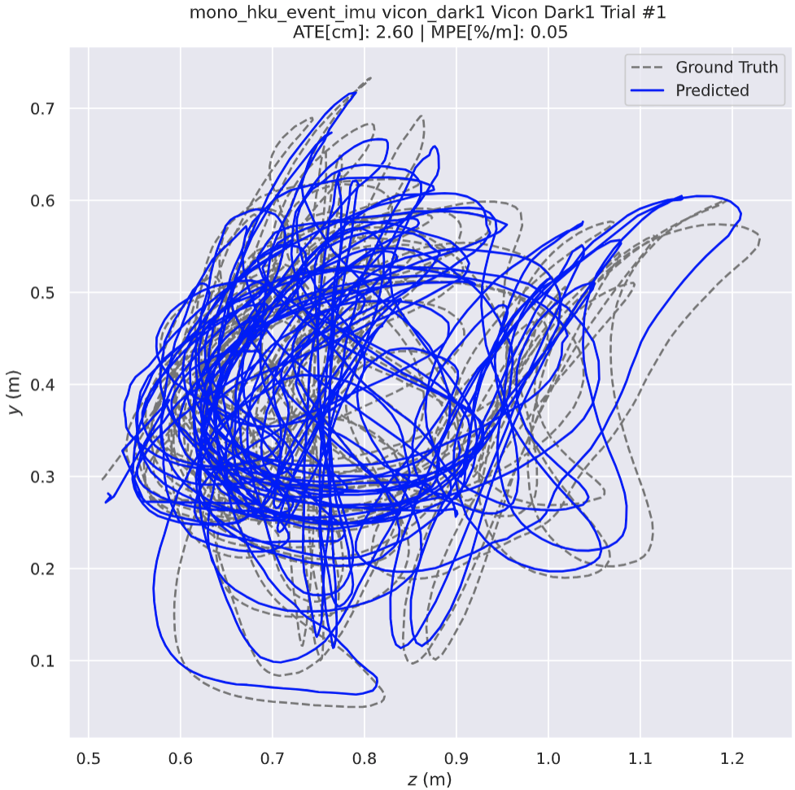
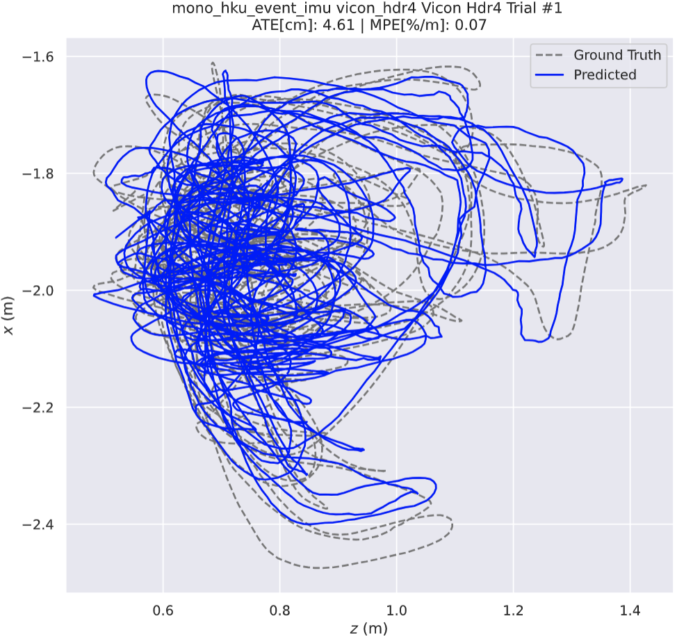
<p>Estimated trajectories against the GT in Mono-HKU Dataset</p>
</div>

### 3. Stereo-HKU Dataset <sup>[3](https://github.com/arclab-hku/Event_based_VO-VIO-SLAM?tab=readme-ov-file#Dataset-for-stereo-evio)</sup>
Download sample sequence from [aggressive_translation, hdr_agg]() (ASL format)

Run the DEIO as the following steps:
~~~
conda activate deio

CUDA_VISIBLE_DEVICES=0 PYTHONPATH=${YOUR_WORKSPACE} python script/eval_eio/deio_stereo_hku.py \
--datapath=${YOUR_DATAFOLDER}  \
--weights=eDBA.pth \
--visual_only=0 \
--evaluate_flag \
--enable_event \
--SCORER_EVAL_USE_GRID
~~~

<br>
<div align="center">
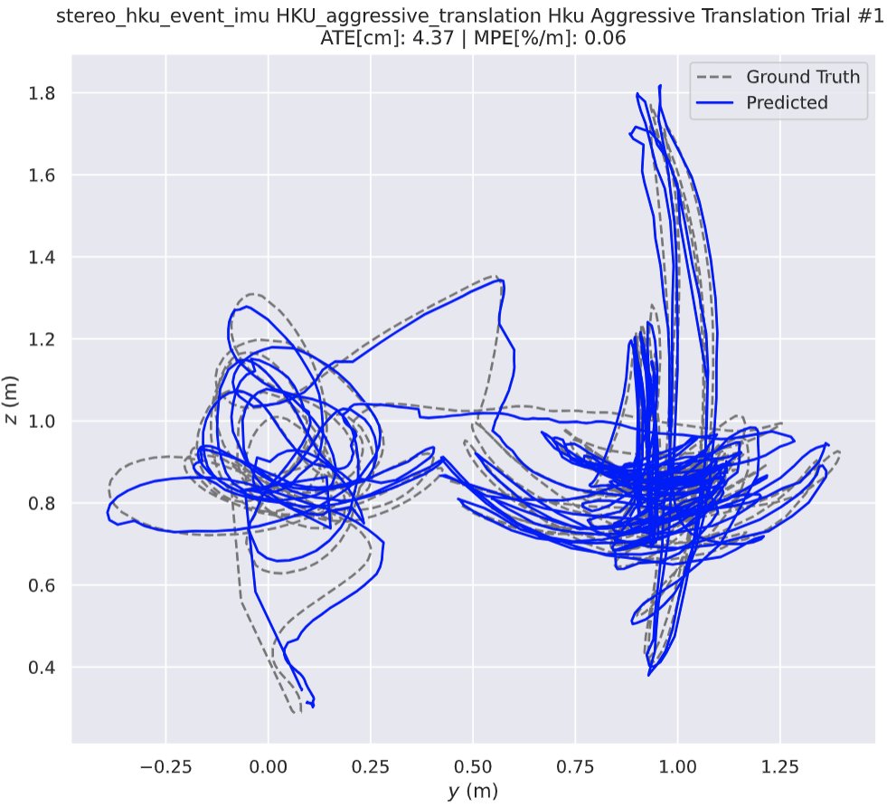
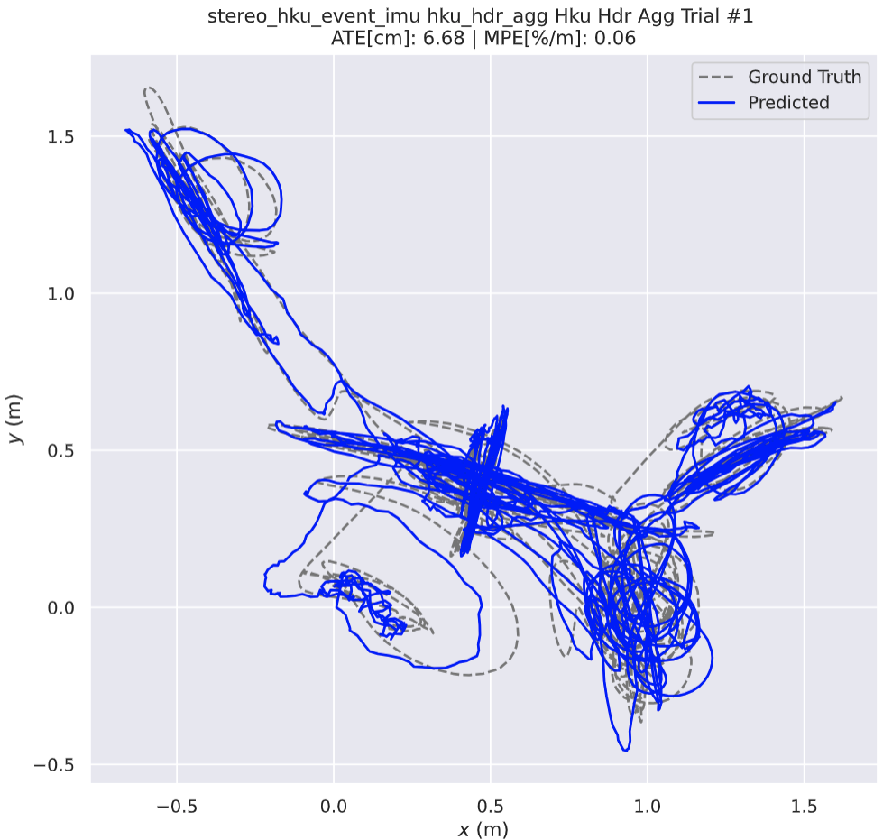
<p>Estimated trajectories against the GT in Stereo-HKU Dataset</p>
</div>


### 4. VECtor <sup>[4](https://star-datasets.github.io/vector/)</sup>
Download sample sequence from [corridors_walk1, units_scooter1]() (ASL format)

Run the DEIO as the following steps:
~~~
conda activate deio

CUDA_VISIBLE_DEVICES=0 PYTHONPATH=${YOUR_WORKSPACE} python script/eval_eio/deio_vector.py \
--datapath=${YOUR_DATAFOLDER}  \
--weights=eDBA.pth \
--visual_only=0 \
--evaluate_flag \
--enable_event \
--SCORER_EVAL_USE_GRID \
~~~

<br>
<div align="center">
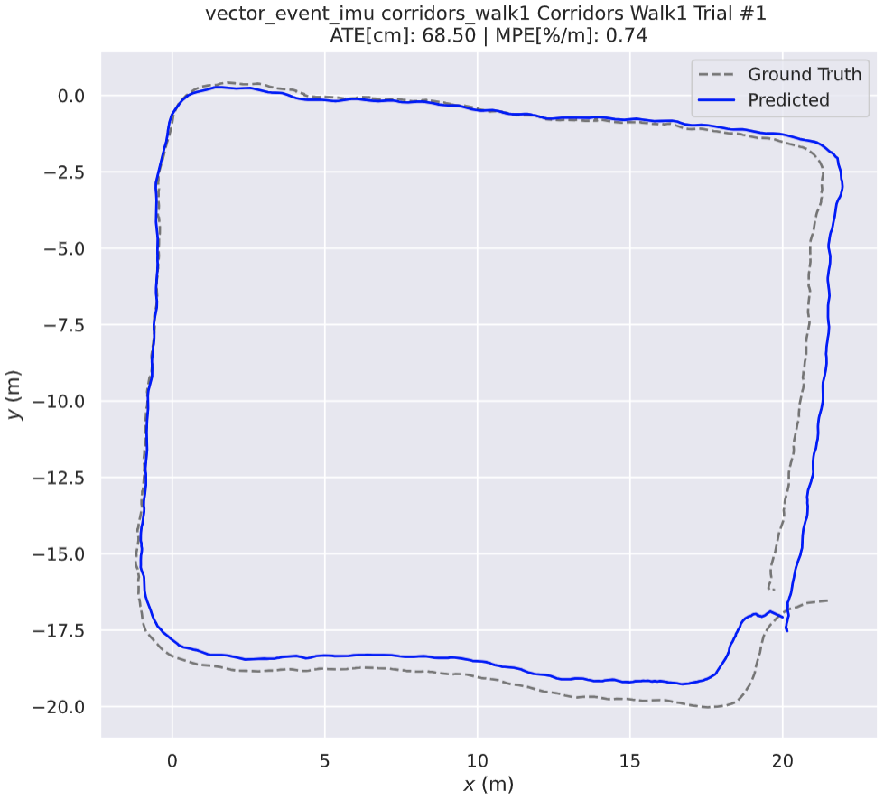
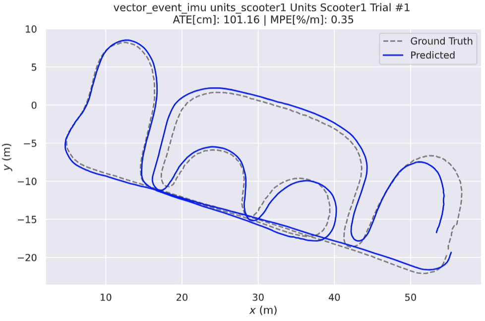
<p>Estimated trajectories against the GT in VECtor</p>
</div>

### 5. TUM-VIE <sup>[5](https://cvg.cit.tum.de/data/datasets/visual-inertial-event-dataset)</sup>
Download sample sequence from [mocap-6dof, mocap-desk2]() (ASL format)

Run the DEIO as the following steps:
~~~
conda activate deio

CUDA_VISIBLE_DEVICES=0 PYTHONPATH=${YOUR_WORKSPACE} python script/eval_eio/deio_tumvie.py \
--datapath=${YOUR_DATAFOLDER}  \
--weights=eDBA.pth \
--visual_only=0 \
--evaluate_flag \
--enable_event \
--SCORER_EVAL_USE_GRID \
~~~

<br>
<div align="center">

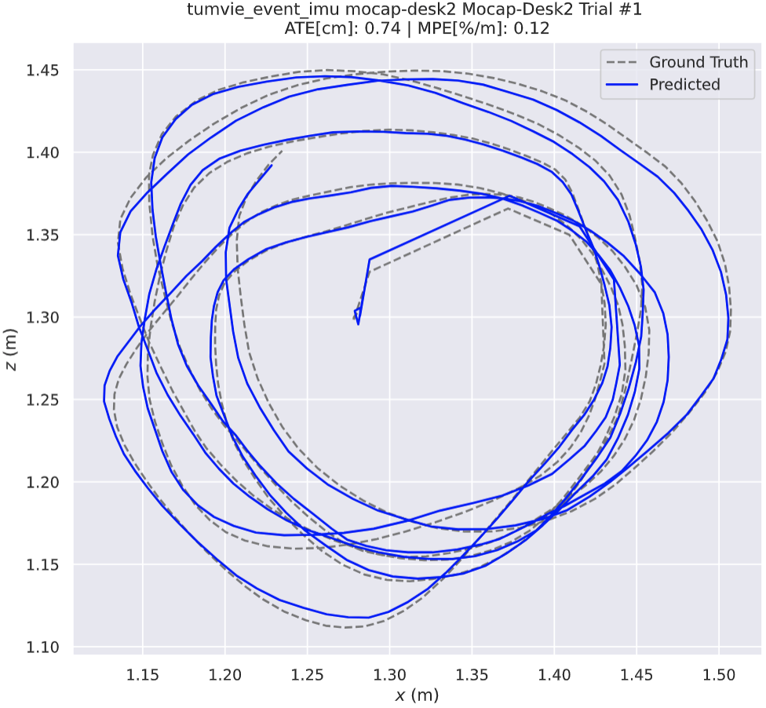
<p>Estimated trajectories against the GT in TUM-VIE Dataset</p>
</div>

### 6. UZH-FPV <sup>[6](https://fpv.ifi.uzh.ch/)</sup>
Download sample sequence from [indoor_forward_6, indoor_forward_7]() (ASL format)

Run the DEIO as the following steps:
~~~
conda activate deio

CUDA_VISIBLE_DEVICES=0 PYTHONPATH=${YOUR_WORKSPACE} python script/eval_eio/deio_uzh_fpv.py \
--datapath=${YOUR_DATAFOLDER}  \
--weights=eDBA.pth \
--visual_only=0 \
--evaluate_flag \
--enable_event \
--SCORER_EVAL_USE_GRID \
~~~

<br>
<div align="center">
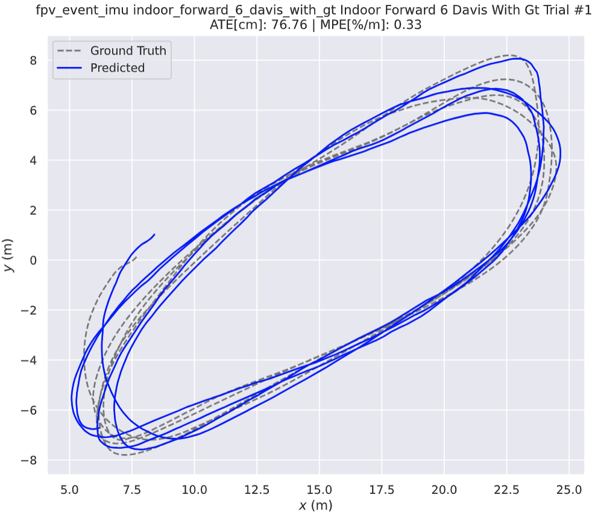
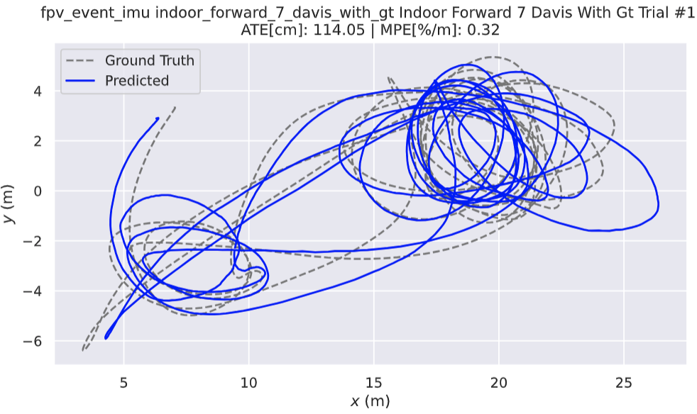
<p>Estimated trajectories against the GT in UZH-FPV</p>
</div>

### 7. MVSEC <sup>[7](https://daniilidis-group.github.io/mvsec/)</sup>

Download sample sequence from [indoor_flying_1, indoor_flying_3]() (ASL format)

Run the DEIO as the following steps:
~~~
conda activate deio

CUDA_VISIBLE_DEVICES=0 PYTHONPATH=${YOUR_WORKSPACE} python script/eval_eio/deio_mvsec.py \
--datapath=${YOUR_DATAFOLDER}  \
--weights=eDBA.pth \
--visual_only=0 \
--evaluate_flag \
--enable_event \
--SCORER_EVAL_USE_GRID \
~~~

<br>
<div align="center">
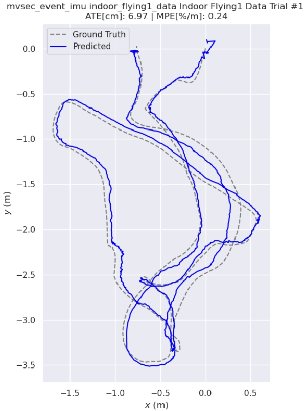
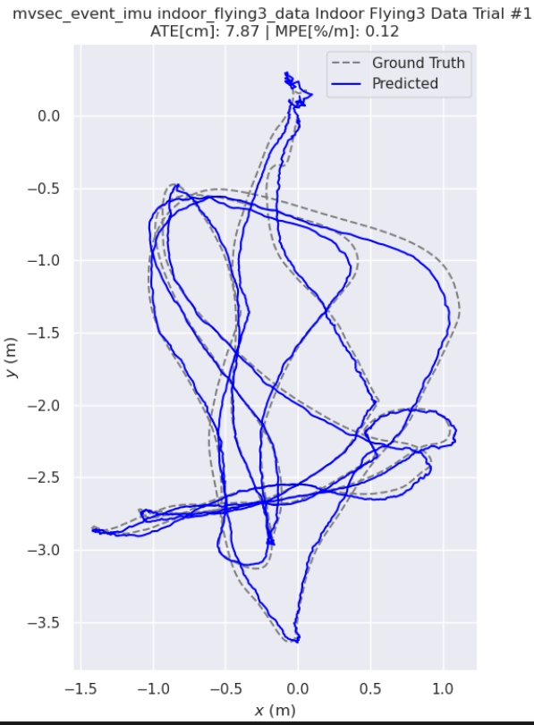
<p>Estimated trajectories against the GT in MVSEC Dataset</p>
</div>


### 8. DSEC <sup>[8](https://dsec.ifi.uzh.ch/)</sup>
Download sample sequence from [dsec_zurich_city_04_a, dsec_zurich_city_04_e]() (ASL format)

Run the DEIO as the following steps:
~~~
conda activate deio

CUDA_VISIBLE_DEVICES=0 PYTHONPATH=${YOUR_WORKSPACE} python script/eval_eio/deio_dsec.py \
--datapath=${YOUR_DATAFOLDER}  \
--weights=eDBA.pth \
--visual_only=0 \
--evaluate_flag \
--enable_event \
--SCORER_EVAL_USE_GRID \
~~~

<br>
<div align="center">
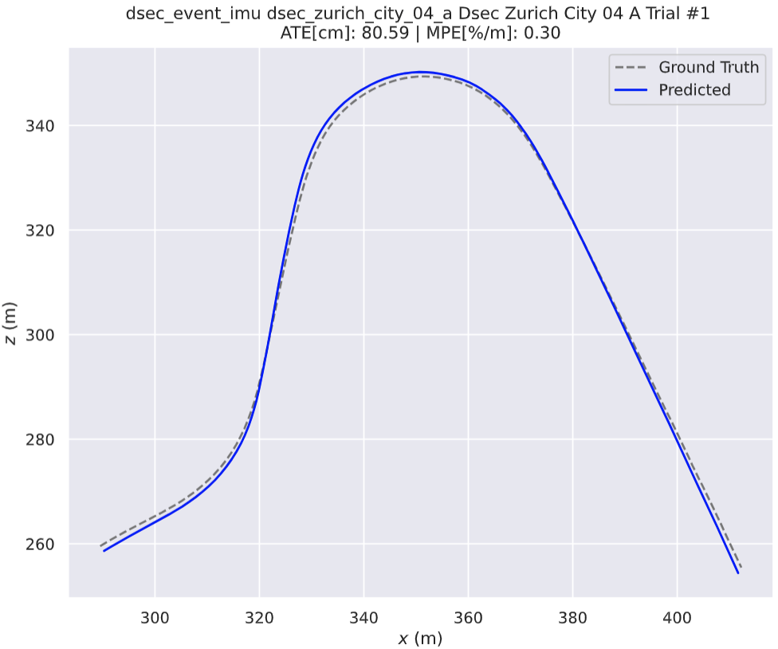
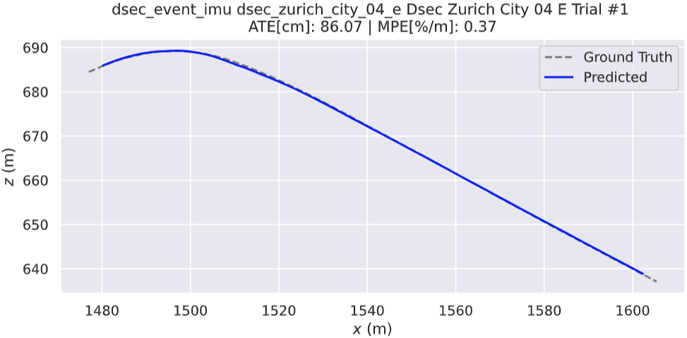
<p>Estimated trajectories against the GT in DSEC</p>
</div>

## Run on Your Own Dataset
* Taking ECMD <sup>[9](https://arclab-hku.github.io/ecmd/)</sup> as an example.
First download the ```rosbag``` file, and then run the following command:

~~~
conda activate deio

CUDA_VISIBLE_DEVICES=2 PYTHONPATH=${YOUR_WORKSPACE} python script/pp_data/pp_ecmd.py --indir=${YOUR_DATAFOLDER}
~~~

* Duplicate a script from [deio_davis240c.py]() or [deio_ecmd.py]()
* In the script, specify the data loading procedure of IMU data and Event loader.
* Specify the timestamp file and unit for both event streams and IMU.
* Specify the event camera intrinsics and camera-IMU extrinsics in the script.
* Try it!

<br>
<div align="center">

<p>Estimated trajectories against the GT in ECMD</p>
</div>

## Using Our Results as Comparison
<div align="justify">
For the convenience of the comparison, we release the estimated trajectories of DEIO in <code>tum</code> format in the dir of <code>estimated_trajectories</code>.
What's more, we also give the <a href="./estimated_trajectories/evo_evaluation_trajectory.ipynb">sample code</a> for the quantitative and qualitative evaluation using <a href="https://github.com/MichaelGrupp/evo">evo package</a>
</div>
<!-- [sample code](../estimated_trajectories/evo_evaluation_trajectory.ipynb) -->


## Acknowledgement
* This work is based on [DPVO](https://github.com/princeton-vl/DPVO), [DEVO](https://github.com/tum-vision/DEVO), [DROID-SLAM](https://github.com/princeton-vl/DROID-SLAM), [DBA-Fusion](https://github.com/GREAT-WHU/DBA-Fusion), and [GTSAM](https://github.com/borglab/gtsam)
* More details about the trainable event representation is available in []()
* If you find this work is helpful in your research, a simple star or citation of our works should be the best affirmation for us. :blush: 


~~~
@article{GWPHKU:DEIO,

}
~~~