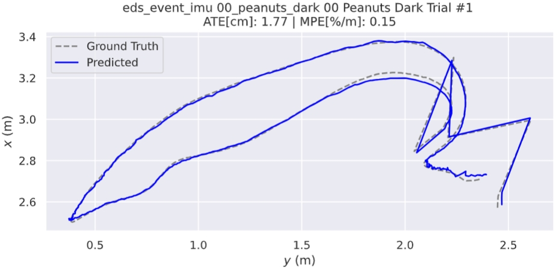
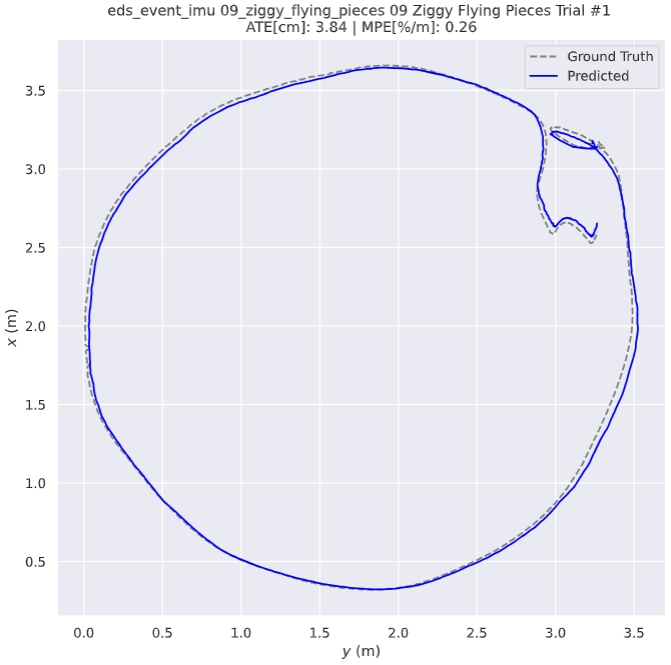

### 1. DAVIS240C <sup>[1](https://rpg.ifi.uzh.ch/davis_data.html)</sup>
Download sample sequence from [boxes_6dof, poster_translation]() (ASL format)

<br>
<div align="center">


<p>Estimated trajectories against the GT in DAVIS240C</p>
</div>

### 2. Mono-HKU Dataset <sup>[2](https://github.com/arclab-hku/Event_based_VO-VIO-SLAM?tab=readme-ov-file#Dataset-for-monocular-evio)</sup>

Download sample sequence from [vicon_dark1, vicon_hdr4]() (ASL format)

<br>
<div align="center">


<p>Estimated trajectories against the GT in Mono-HKU Dataset</p>
</div>

### 3. Stereo-HKU Dataset <sup>[3](https://github.com/arclab-hku/Event_based_VO-VIO-SLAM?tab=readme-ov-file#Dataset-for-stereo-evio)</sup>
Download sample sequence from [aggressive_translation, hdr_agg]() (ASL format)

<br>
<div align="center">


<p>Estimated trajectories against the GT in Stereo-HKU Dataset</p>
</div>


### 4. VECtor <sup>[4](https://star-datasets.github.io/vector/)</sup>
Download sample sequence from [corridors_walk1, units_scooter1]() (ASL format)

<br>
<div align="center">


<p>Estimated trajectories against the GT in VECtor</p>
</div>

### 5. TUM-VIE <sup>[5](https://cvg.cit.tum.de/data/datasets/visual-inertial-event-dataset)</sup>
Download sample sequence from [mocap-6dof, mocap-desk2]() (ASL format)

<br>
<div align="center">


<p>Estimated trajectories against the GT in TUM-VIE Dataset</p>
</div>

### 6. UZH-FPV <sup>[6](https://fpv.ifi.uzh.ch/)</sup>
Download sample sequence from [indoor_forward_6, indoor_forward_7]() (ASL format)

<br>
<div align="center">


<p>Estimated trajectories against the GT in UZH-FPV</p>
</div>

### 7. MVSEC <sup>[7](https://daniilidis-group.github.io/mvsec/)</sup>

Download sample sequence from [indoor_flying_1, indoor_flying_3]() (ASL format)


<br>
<div align="center">


<p>Estimated trajectories against the GT in MVSEC Dataset</p>
</div>


### 8. DSEC <sup>[8](https://dsec.ifi.uzh.ch/)</sup>
Download sample sequence from [dsec_zurich_city_04_a, dsec_zurich_city_04_e]() (ASL format)

<br>
<div align="center">


<p>Estimated trajectories against the GT in DSEC</p>
</div>

### 9. EDS <sup>[9](https://rpg.ifi.uzh.ch/eds.html)</sup>
Download sample sequence from [00_peanuts_dark, 09_ziggy_flying_pieces]() (ASL format)

<br>
<div align="center">


<p>Estimated trajectories against the GT in EDS</p>
</div>

## Run on Your Own Dataset
* Taking ECMD <sup>[9](https://arclab-hku.github.io/ecmd/)</sup> as an example.
First download the ```rosbag``` file, and then run the following command:

~~~
conda activate deio

CUDA_VISIBLE_DEVICES=2 PYTHONPATH=${YOUR_WORKSPACE} python script/pp_data/pp_ecmd.py --indir=${YOUR_DATAFOLDER}
~~~

* Duplicate a script from [deio_davis240c.py]() or [deio_ecmd.py]()
* In the script, specify the data loading procedure of IMU data and Event loader.
* Specify the timestamp file and unit for both event streams and IMU.
* Specify the event camera intrinsics and camera-IMU extrinsics in the script.
* Try it!

<br>
<div align="center">

<p>Estimated trajectories of our DEIO against the GNSS-INS-RTK in ECMD</p>
</div>